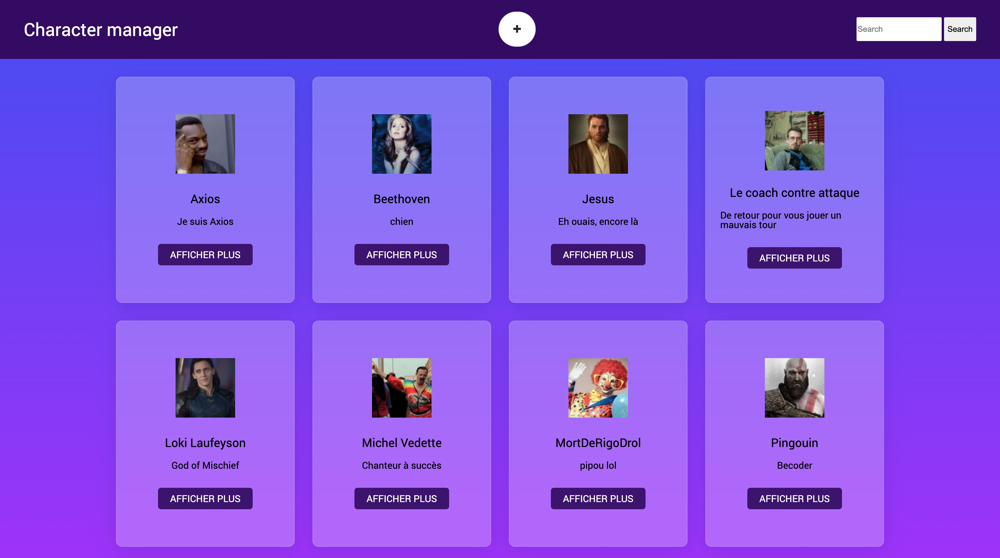

# character-manager-js

Faire une dashboard pour afficher des personnages qui provient d'une api crée par Becode. [Lien de l'api](https://character-database.becode.xyz/characters)

## Screenshot

## Langage utilisé:

Html, SCSS, JS.

## Fait par:

- [Louis collard](https://github.com/louiscollard?tab=repositories)
- [Marlene Bouvard](https://github.com/llyllyra?tab=repositories)

## Projet mis en ligne:

Le projet à été mis en ligne sur netifly

[Lien](https://amazing-stroopwafel-62de73.netlify.app/)
